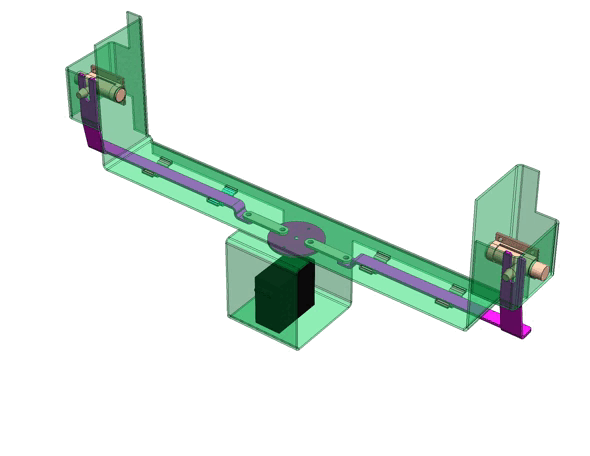
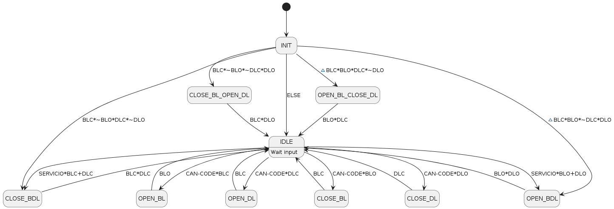
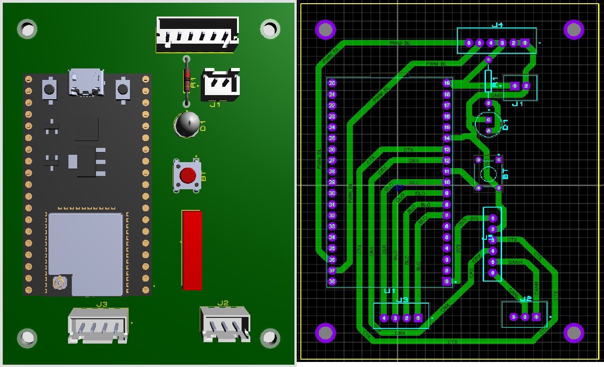

# Proyecto del Mecanismo de Bloqueo

Este proyecto incluye componentes de hardware y software, integrando diversas disciplinas como electrónica, mecánica y sistemas embebidos.

## Estructura del Proyecto

El proyecto está organizado en varios directorios y archivos clave:

- **.devcontainer**: Archivos de configuración para el contenedor de desarrollo.
- **.gitignore**: Especifica archivos y directorios que deben ser ignorados por Git.
- **CMakeLists.txt**: Archivo de configuración de CMake para compilar el proyecto.
- **dependencies.lock**: Archivo de bloqueo de dependencias del proyecto.
- **electronics**: Contiene esquemas, diseños de PCB, diseño de cajas, archivos STL y documentos relacionados.
- **main**: Código fuente y lógica principal de la aplicación.

## Funcionamiento

El programa inicializa las variables y el estado inicial en base al estado de los finales de carrera. Si el candado de la batería está cerrado y el de la puerta está abierto, el programa cierra el candado de la batería y abre el candado de la puerta. Si el candado de la batería presenta un error (cerrado y abierto al mismo tiempo) y el de la puerta está cerrado, el programa abre el candado de la batería y cierra el de la puerta. Si ninguna de estas condiciones se cumple, el programa entra en un estado de espera.

En el estado de espera, el programa aguarda una entrada que determine su próximo movimiento. Dependiendo de la entrada. Por ejemplo:
- Si se recibe la entrada CAN correspondiente y el candado de la batería está abierto, el programa cierra el candado de la batería.
- Si hay la entrada CAN correspondiente y el candado de la puerta está abierto, el programa cierra el candado de la puerta.

Además, hay condiciones especiales que dictan las transiciones del programa:
- Al activar el botón de servicio, si algun candado está abierto, el programa abre ambos candados.
- Al activar el botón de servicio, si algun candado esta cerrado, el programa cierra ambos candados.

El programa también maneja estados intermedios para la apertura y cierre de los candados de manera específica. Por ejemplo, un estado puede encargarse de cerrar el candado de la batería mientras abre el de la puerta, y otro puede hacer lo contrario. 

## Conexiones

Se diseñó un prototipo de PCB basado en la placa de desarrollo ESP32 de 38 pines.

Las conecciones del sistema se ilustran en el siguiente diagrama. 

Significado de los acrónimos:
| Acrónimo | Description           | Descripción                    |
|----------|------------------------|--------------------------------|
| DLO      | Door Lock Open         | Apertura de la cerradura de la puerta |
| DLC      | Door Lock Close        | Cierre de la cerradura de la puerta   |
| BLO      | Battery Lock Open      | Apertura de la cerradura de la batería |
| BLC      | Battery Lock Close     | Cierre de la cerradura de la batería   |
| PWM-DL   | PWM Door Lock          | Cerradura de la puerta PWM            |
| PWM-BL   | PWM Battery Lock       | Cerradura de la batería PWM           |
