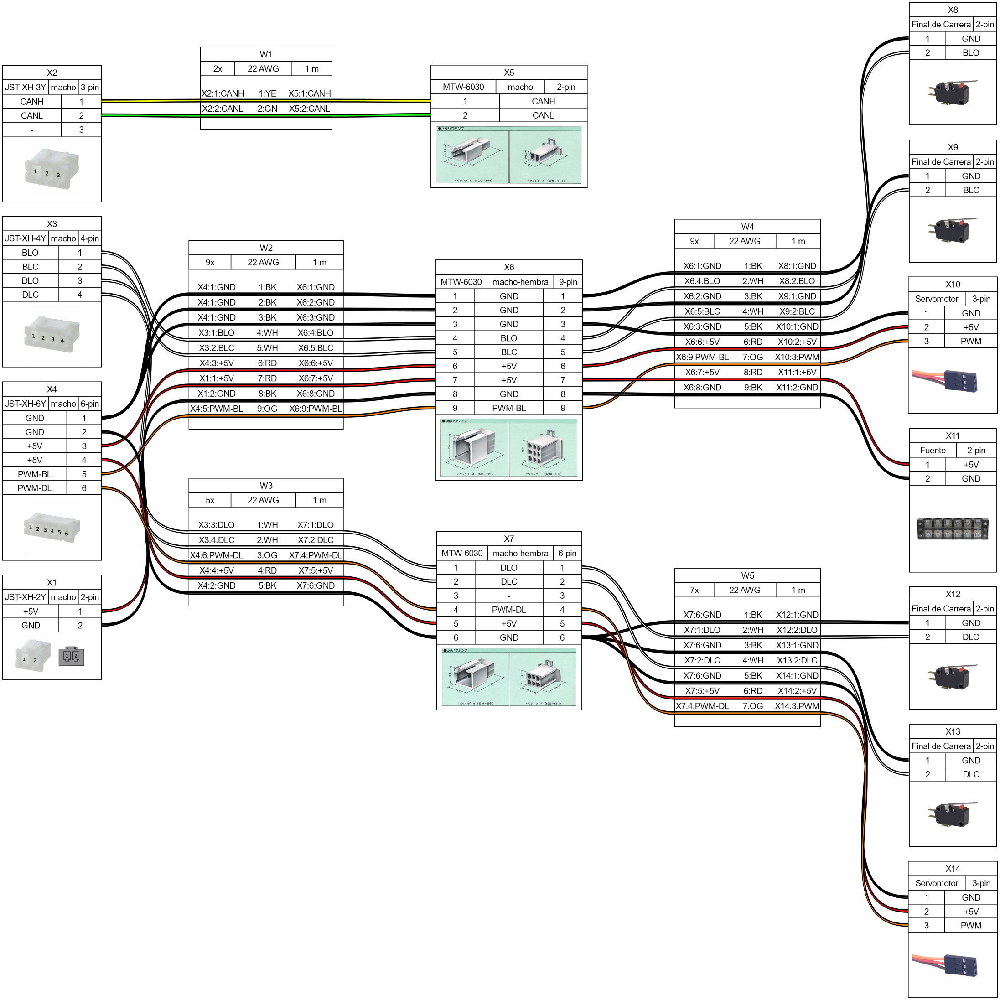

# Proyecto del Mecanismo de Bloqueo

## Descripción General del Proyecto

El proyecto del Mecanismo de Bloqueo está diseñado para desarrollar un mecanismo robusto y eficiente para el intercambio de componentes electrónicos dentro de un sistema especificado. Este proyecto incluye componentes de hardware y software, integrando diversas disciplinas como electrónica, mecánica y sistemas embebidos.

## Estructura del Proyecto

El proyecto está organizado en varios directorios y archivos clave:

- **.devcontainer**: Archivos de configuración para el contenedor de desarrollo.
- **.gitignore**: Especifica archivos y directorios que deben ser ignorados por Git.
- **CMakeLists.txt**: Archivo de configuración de CMake para compilar el proyecto.
- **dependencies.lock**: Archivo de bloqueo de dependencias del proyecto.
- **electronics**: Contiene esquemas, diseños de PCB, diseño de cajas, archivos STL y documentos relacionados.
- **main**: Código fuente y lógica principal de la aplicación.

## Conexiones

El proyecto involucra varias conexiones como se ilustra en el diagrama proporcionado. 

Aquí tienes la tabla con los acrónimos de Door y Battery:

| Acrónimo | Descripción            |
|----------|------------------------|
| DLO      | Door Lock Open         |
| DLC      | Door Lock Close        |
| BLO      | Battery Lock Open      |
| BLC      | Battery Lock Close     |
| PWM-DL   | PWM Door Lock          |
| PWM-BL   | PWM Battery Lock       |